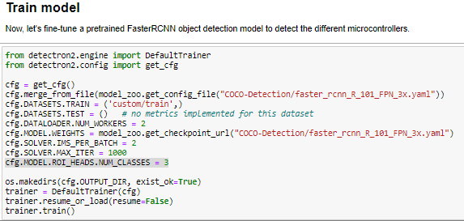

# Grape-leaf-disease-object-detection-using-detectron-2

## im using google collab cause, easy to install enviroment

This is an implementation of Detectron2 on Python 3 using pytorch framework. The model generates bounding boxes and classify each object in the image.

The repository includes:
* convert xml to CSV
* Source code of Detectron2.
* Jupyter notebooks to visualize the detection pipeline
* Evaluation on MS COCO metrics (AP) (Soon)
* Example of training on your own dataset

## Installation
1. Clone this repository

# Getting Started
* convert XML to csv
* open Detectron2_custom_object_detection.ipynb (this code include all  Training, Testing and evaluation soon)

# step to convert XML to Csv 

## 1. Prepare dataset and make sure the path 
open code xml_to_csv.py (just make sure the path right)

## 2.convert json to COCO 
just execute the code

# Step to train  with your own data

## 1. train own dataset
This example will explain which part u must change to train your own dataset. open Detectron2_custom_object_detection.ipynb fi

First we must register out dataset and define the label name

then we the part u must change is config for train model

## 2. Execute all program 
just run all part and get the result

## 3. result like this

